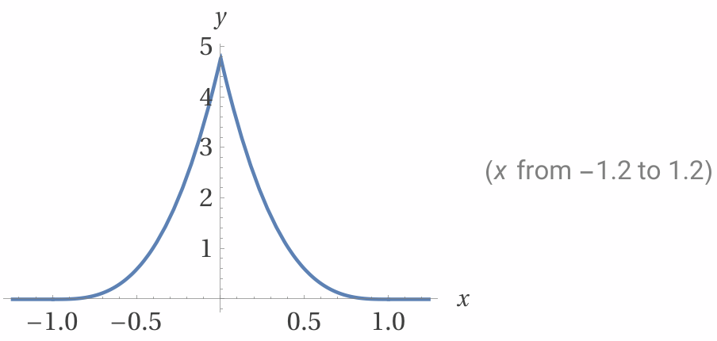
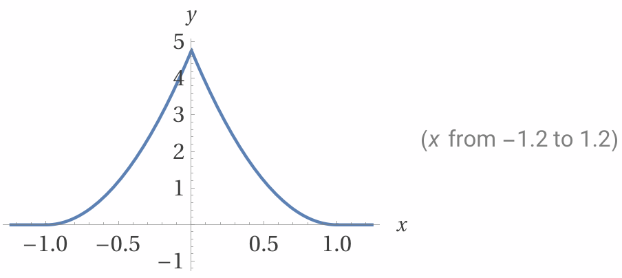

# Real Time Fluid Simulation

<br />
<div align="center">
<div style="display: flex; justify-content: center; align-items: center; margin-bottom:50px;">
    <div style=align-items: center;">
        <div style="display: flex; flex-direction: column; margin-right: 20px;">
            <h3 id="readme-top">Smoothed Particle Hydrodynamics Fluid Simulator</h3>
            <p>Real-time 2D fluid simulation using SPH (Smoothed Particle Hydrodynamics) and Navier-Stokes equations. <br>Built with Godot Engine and C#.</p>
            <a href="https://docs.godotengine.org/"><strong>Godot Engine Documentation »</strong></a>
        </div>
        <div>
            
            
        </div>
    </div>
</div>
    </img>
    <br />
    <br />
  </p>
</div>

<details>
  <summary>Table of Contents</summary>
  <ol>
    <li>
      <a href="#about-the-project">About the Project</a>
      <ul>
        <li><a href="#project-goal">Project Goal</a></li>
      </ul>
    </li>
    <li>
      <a href="#getting-started">Getting Started</a>
      <ul>
        <li><a href="#requirements">Requirements</a></li>
        <li><a href="#installation">Installation</a></li>
      </ul>
    </li>
    <li>
      <a href="#usage">Usage</a>
      <ul>
        <li><a href="#controls">Controls</a></li>
        <li><a href="#adjustable-parameters">Adjustable Parameters</a></li>
      </ul>
    </li>
    <li>
      <a href="#technical-implementation">Technical Implementation</a>
      <ul>
        <li><a href="#smoothed-particle-hydrodynamics">Smoothed Particle Hydrodynamics</a></li>
        <li><a href="#navier-stokes-equations">Navier-Stokes Equations</a></li>
        <li><a href="#smoothing-kernels">Smoothing Kernels</a></li>
      </ul>
    </li>
    <li>
      <a href="#project-structure">Project Structure</a>
      <ul>
        <li><a href="#file-descriptions">File Descriptions</a></li>
      </ul>
    </li>
  </ol>
</details>

## About the Project

This project implements a real-time CPU based 2D fluid simulation using **Smoothed Particle Hydrodynamics (SPH)** for modeling fluid dynamics. Particles represent fluid elements and interact with each other based on density, pressure, and viscosity calculations derived from the Navier-Stokes equations.

The simulator runs efficiently in real-time using spatial hashing for neighbor particle lookups and multi-threaded parallel processing for physics calculations.

### Project Goal

The goal of this project is to demonstrate the practical application of the **Navier-Stokes equations** and **Smoothed Particle Hydrodynamics** in real-time simulations. The implementation focuses on:

- **Accurate fluid dynamics**: Modeling pressure, viscosity, and gravity forces
- **Performance optimization**: Using spatial grid optimization to reduce computational complexity
- **Interactive visualization**: Real-time rendering with velocity-based color mapping
- **Educational value**: Providing a clear implementation of physics-based simulation techniques

This is a capstone project for the Real Time Physics class, showcasing how complex fluid dynamics can be simulated efficiently on modern hardware.

<p align="right">(<a href="#readme-top">Back to Top</a>)</p>

## Getting Started

### Requirements

To run this project, you will need:

- **Godot Engine 4.2+** ([Download](https://godotengine.org/))
- **.NET 8.0 SDK** ([Download](https://dotnet.microsoft.com/download))
- **Visual Studio Code** or any C# IDE (recommended for development)

### Installation

1. Clone or download this repository

2. Open Godot Engine 4.2 or later

3. Click "Open" and navigate to the project directory containing `project.godot`

4. The project should load automatically with all scenes and scripts

5. Click the Play button (or press F5) to run the simulation

<p align="right">(<a href="#readme-top">Back to Top</a>)</p>

## Usage

### Controls

- **Left Mouse Button**: Apply attractive force to particles (towards cursor)
- **Right Mouse Button**: Apply repulsive force to particles (away from cursor)

### Adjustable Parameters

The simulation provides real-time adjustable parameters via UI sliders:

| Parameter | Description |
|-----------|-------------|
| **Target Density** | Desired density of the fluid |
| **Pressure Multiplier** | Stiffness of pressure forces (pressure scale) |
| **Near Pressure Multiplier** | Stiffness of near-field pressure |
| **Gravity** | Gravitational acceleration downward |
| **Damping** | Velocity damping on wall collisions |
| **Smoothing Radius** | Kernel support radius |
| **Viscosity** | Fluid viscosity strength |

<p align="right">(<a href="#readme-top">Back to Top</a>)</p>

## Technical Implementation

### Smoothed Particle Hydrodynamics

Smoothed Particle Hydrodynamics is a method where fluid properties are approximated at any location by a weighted sum of contributions from all particles within a kernel radius. Any property $A$ is approximated as:

$$A(\mathbf{r}) = \sum_{j} m_j \frac{A_j}{\rho_j} W(\mathbf{r} - \mathbf{r}_j, h)$$

where:
- $m_j$ is the mass of particle $j$
- $\rho_j$ is the density of particle $j$
- $W(\mathbf{r}, h)$ is a smoothing kernel function
- $h$ is the kernel support radius (smoothing radius)

### Navier-Stokes Equations

The Navier-Stokes equations control fluid motion. In the context of SPH, the acceleration of a particle is computed from pressure and viscosity forces:

$$\frac{d\mathbf{v}_i}{dt} = -\frac{1}{\rho_i}\nabla p_i + \nu \nabla^2 \mathbf{v}_i + \mathbf{g}$$

where:
- $\mathbf{v}_i$ is velocity
- $p$ is pressure
- $\rho$ is density
- $\nu$ is kinematic viscosity
- $\mathbf{g}$ is external forces (gravity)

### Smoothing Kernels

The simulation uses different smoothing kernels for different physical quantities:

#### Primary Smoothing Kernel (Pressure & Density)

$$W(r, h) = \frac{15}{\pi h^4} \begin{cases} (h - r)^2, & r \leq h \\ 0 & \end{cases}$$

<div align="center">
    </img>
    <br />
    <br />
</div>

Its derivative is:
$$\nabla W(r, h) = \frac{12}{\pi h^4}(r - h) \hat{r}$$

Implementation in code:

```csharp
public float SmoothingFunction(float dst, float radius) 
{
    return (radius - dst) * (radius - dst) / volume; 
}

public float SmoothingFunctionDerivative(float dst, float radius) 
{
    return (dst - radius) * scale;
}
```

The constants are pre-calculated:
$$\text{volume} = \frac{\pi h^4}{6}, \quad \text{scale} = \frac{12}{\pi h^4}$$

#### Near-Field Smoothing Kernel

For improved pressure stability, a second "near pressure" kernel is used:

$$W_{\text{near}}(r, h) = \frac{15}{\pi h^5} \begin{cases} (h - r)^3, & r \leq h \\ 0 & \end{cases}$$

<div align="center">
    </img>
    <br />
    <br />
</div>

Its derivative:
$$\nabla W_{\text{near}}(r, h) = -\frac{45}{\pi h^5}(h - r)^2 \hat{r}$$

Implementation:

```csharp
public float NearSmoothingFunction(float dst, float radius) 
{
    float diff = radius - dst;
    return diff * diff * diff / nearVolume; 
}

public float NearSmoothingFunctionDerivative(float dst, float radius) 
{
    float diff = radius - dst;
    return -3.0f * diff * diff / nearVolume;
}
```

#### Viscosity Smoothing Kernel

$$W_{\text{visc}}(r, h) = \frac{15}{\pi h^4} \begin{cases} (h - r)^2, & r \leq h \\ 0 & \end{cases}$$

<div align="center">
    </img>
    <br />
    <br />
</div>

```csharp
public float ViscositySmoothingFunction(float dst, float radius) 
{
    return (radius - dst) * (radius - dst) / volume; 
}
```
#### Precalcuating
This function is used to pre-calculate all the constants mentioned above.

```csharp
	public void RecalculateSmoothingConstants()
	{
		volume = (MathF.PI * MathF.Pow(SmoothingRadius, 4)) / 6.0f;
		scale  =  12 / (MathF.Pow(SmoothingRadius, 4)) * MathF.PI;
		nearVolume = (MathF.PI * MathF.Pow(SmoothingRadius, 5)) / 10.0f;
		.
        .
        .
	}
```
### Spatial Grid Optimization

To avoid O(n²) complexity in neighbor searches, the simulation uses **spatial hashing** with a grid-based data structure:

#### Grid Hashing Strategy

Particles are sorted into spatial cells with size equal to the smoothing radius. Each cell is hashed to a unique key:

```csharp
// Convert particle position to grid cell coordinates
public (int x, int y) PositionToCellCoord(Vector2 point, float radius)
{
    int cellX = (int)(point.X / radius);
    int cellY = (int)(point.Y / radius);
    return (cellX, cellY);
}

// Hash cell coordinates to a single integer
public uint HashCell(int cellX, int cellY)
{
    uint a = (uint) cellX * 15823;
    uint b = (uint) cellY * 9737333;
    return a + b;
}

// Reduce hash to array bounds
public uint GetKeyFromHash(uint hash)
{
    return hash % (uint)spatialLookup.Length;
}
```

#### Grid Update Process

The spatial lookup is updated once per frame:

```csharp
public void UpdateSpatialLookup()
{
    // Step 1: Compute cell keys for all particles in parallel
    Parallel.For(0, ParticleCount, i =>
    {
        (int cellX, int cellY) = PositionToCellCoord(predictedPositions[i], SmoothingRadius);
        uint cellKey = GetKeyFromHash(HashCell(cellX, cellY));
        spatialLookup[i] = new Entry(i, cellKey);
    });

    // Step 2: Count particles per cell and compute start indices
    Array.Clear(counts, 0, ParticleCount);
    for (int i = 0; i < ParticleCount; i++)
        counts[spatialLookup[i].CellKey]++;

    int total = 0;
    for (int key = 0; key < ParticleCount; key++)
    {
        startIndices[key] = counts[key] > 0 ? total : int.MaxValue;
        int c = counts[key];
        counts[key] = total;
        total += c;
    }

    // Step 3: Scatter sort into contiguous memory
    for (int i = 0; i < ParticleCount; i++)
        sortBuffer[counts[spatialLookup[i].CellKey]++] = spatialLookup[i];

    // Step 4: Swap buffers
    (spatialLookup, sortBuffer) = (sortBuffer, spatialLookup);
}
```

#### Neighbor Lookup

When searching for neighbors, only the 9 neighboring cells (3×3 grid) are checked:

```csharp
// The 9 neighbor cells (including the center cell) to search
private readonly (int x, int y)[] cellOffsets = {
    (-1, 1), (0, 1), (1, 1),
    (-1, 0), (0, 0), (1, 0),
    (-1, -1), (0, -1), (1, -1)
};

// In neighbor search
foreach ((int offsetX, int offsetY) in cellOffsets)
{
    uint key = GetKeyFromHash(HashCell(centerX + offsetX, centerY + offsetY));
    int cellStartIndex = startIndices[key];

    if (cellStartIndex == int.MaxValue) continue; // Cell is empty

    for (int i = cellStartIndex; i < spatialLookup.Length; i++)
    {
        if (spatialLookup[i].CellKey != key) break; // All particles scanned
        // Process neighbor...
    }
}
```

This reduces the neighbor search from O(n) to O(m) where m is typically 30-50 particles, significantly improving performance.


<p align="right">(<a href="#readme-top">Back to Top</a>)</p>

## Project Structure

```
fluid-simulation/
├── src/
│   └── Main.cs              # Main simulation loop and physics calculations
├── shaders/
│   └── particle.gdshader    # Circle rendering shader for particles
├── scenes/
│   └── Main.tscn           # Main scene with UI and viewport
├── resources/
│   └── gradient.tres       # Velocity gradient for color mapping
├── imgs/                   # Screenshot and GIF storage folder
├── fluid-simulation.csproj # C# project configuration
├── fluid-simulation.sln    # Visual Studio solution file
├── project.godot          # Godot project configuration
└── README.md             # This file

```

### File Descriptions

**`src/Main.cs`** — Contains the complete simulation logic:
- Particle initialization and physics state
- SPH density and pressure calculations
- Viscosity force computation
- Spatial grid hashing and neighbor lookup
- Rendering with multi-mesh instances
- UI parameter management

**`shaders/particle.gdshader`** — Godot shader for rendering particles:
- Renders each particle as a circular quad
- Discards pixels outside the circle for smooth particle appearance

**`scenes/Main.tscn`** — Godot scene setup:
- Node hierarchy and component organization
- UI layout with parameter sliders
- Viewport configuration

**`resources/gradient.tres`** — Color gradient resource:
- Maps particle velocity to color (blue = slow, red = fast)
- Used for visual feedback of fluid flow

<p align="right">(<a href="#readme-top">Back to Top</a>)</p>

## Performance Notes

- **Particle Count**: Currently simulates 3,000 particles in real-time
- **Grid Optimization**: Reduces neighbor search from O(n²) to O(n), enabling real-time simulation
- **Parallel Processing**: Uses `Parallel.For` for density and force calculations across CPU cores
- **Memory Efficiency**: Pre-allocated arrays and cached gradient values minimize GC pressure

**References**
---
- [*Coding Adventure: Simulating Fluids*, Youtube: Sebastian Lague](https://youtu.be/rSKMYc1CQHE?si=uDUP5b7gmtFeddMo)
- [*Smoothed-particle hydrodynamics*, Wikipedia](https://en.wikipedia.org/wiki/Smoothed-particle_hydrodynamics)
- [*Navier–Stokes equations*, Wikipedia](https://en.wikipedia.org/wiki/Navier%E2%80%93Stokes_equations)


